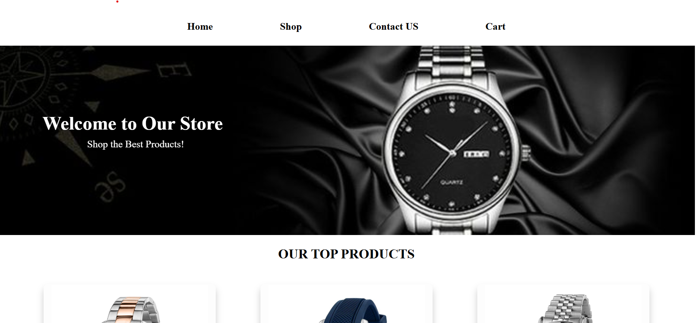
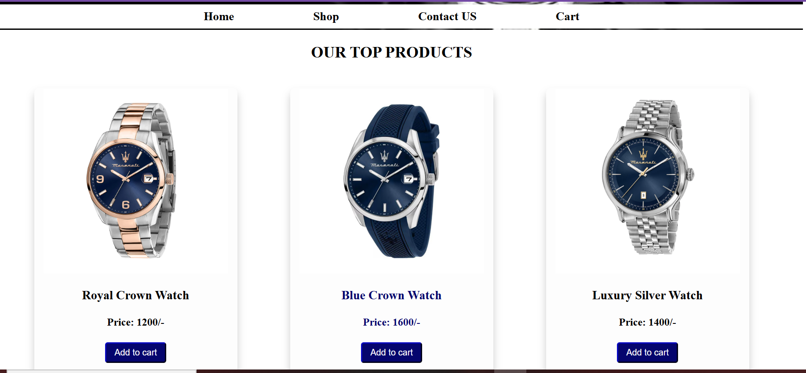

# Omega Men's Watches - Landing Page

Welcome to the **Omega Men's Watches** landing page! This project is built using **HTML & Custom CSS** to showcase premium watches with a sleek and elegant design.


## 🛠️ Technologies Used
- **HTML** - For structuring the webpage
- **CSS** - Custom styles for an elegant look

## 🌟 Features
- **Modern & Responsive Design** ✅
- **Custom CSS Animations & Effects** 🎨
- **High-Quality Watch Showcase** ⌚
- **Call-to-Action Sections** 🔥

## 📸 Screenshots
### 🖼️ Landing Page


### 🖼️ Product Showcase Section


## 🚀 How to Use
1. **Clone the repository**
   ```sh
   git clone https://github.com/Adeeb-Ali24/Omega-mens-watches-landing-page.git
   ```
2. **Open the `index.html` file** in any browser.

## 📂 Project Structure
```
📁 Omega-mens-watches-landing-page
├── 📂 images        # Project images
├── 📜 index.html    # Main landing page
├── 📜 styles.css    # Custom styles
└── 📜 README.md     # Documentation
```

## 🤝 Contributing
Feel free to contribute by submitting pull requests or issues.

## 📞 Contact
For any queries, reach out at **adeebali2001@gmail.com**

---
### ⭐ Don't forget to give this repo a star if you like it! ⭐

